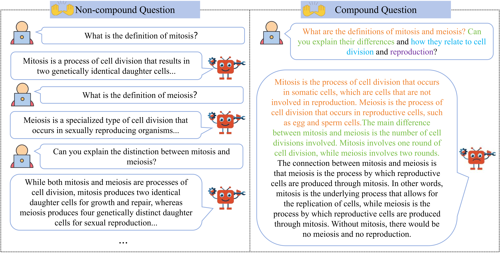
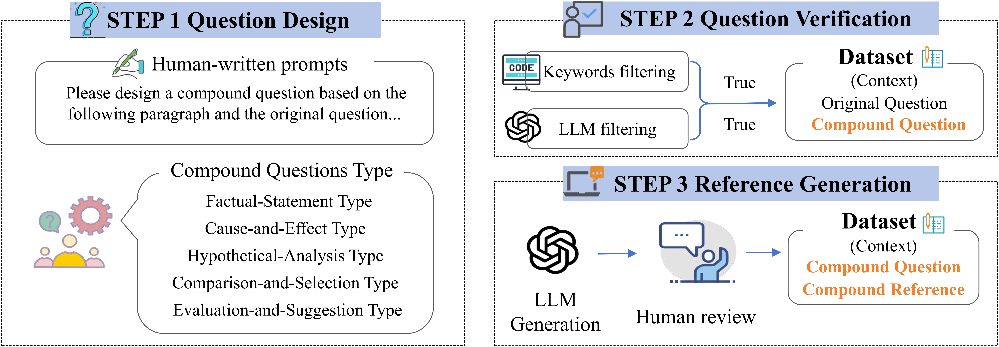

# Compound-QA Dataset

## Overview

**Compound-QA** is a benchmark designed to evaluate Large Language Models (LLMs) on compound questions—queries that incorporate multiple sub-questions within a single turn. While such questions are ubiquitous in natural human-AI interaction and critical for agentic applications requiring task decomposition, handling them remains non-trivial. LLMs often suffer from sub-question omission and response degradation due to intrinsic challenges such as **hierarchical dependencies** between queries, **contextual interference**, and **referential ambiguity**. To systematically analyze these capabilities, we categorize compound questions into five distinct types based on the dominant logical relationships between their sub-questions.


<p align="center">
  
  <br>
  <em>Examples of non-compound (left) and compound (right) questions: the former poses multiple questions across turns, while the latter combines them within a single turn.</em>
</p>

---


## Data Curation

The dataset comprises three subsets dedicated to **Knowledge**, **Reasoning**, and **Understanding**. Each dimension features five distinct question types, including *Factual-Statement*, *Cause-and-Effect*, *Hypothetical-Analysis*, *Comparison-and-Selection*, and *Evaluation-and-Suggestion*.


<p align="center">
  
  <br>
  <em>The overview of CQ-Syn Data Synthesis.</em>
</p>


The synthesis process involves three streamlined steps:

*   **Step 1: Question Design.** LLMs generate compound questions using context-aware prompts and manual examples to ensure natural distribution.
*   **Step 2: Question Verification.** A hybrid filter combining specific keyword rules and LLM-based verification removes invalid generations.
*   **Step 3: Reference Generation.** Answers are generated by proprietary LLMs and retained only after unanimous human verification for completeness and accuracy.

---


## Directory structure

The `data/` directory is organized by capability, with subdirectories for each question type.

```text
data/
├── Understanding/
│   ├── Factual-Statement/
│   ├── Cause-and-Effect/
│   ├── Hypothetical-Analysis/
│   ├── Comparison-and-Selection/
│   └── Evaluation-and-Suggestion/
├── Reasoning/
│   └── (Same structure as above)
└── Knowledge/
    └── (Same structure as above)
```
---

## Required fields for each record

Each data entry must include the following fields:

* `ID` — unique identifier 
* `context` — optional background or passage 
* `com_question` — compound question covering multiple sub-questions
* `com_reference` — reference answer covering all sub-questions

Example JSON record:

```json
{
  "ID": "xxx_1",
  "context": "<optional background or passage>",
  "com_question": "<compound question>",
  "com_reference": "<reference answer covering all sub-questions>"
}
```
---

## Citation

If you use the Compound-QA dataset or find our work useful, please cite our paper:

```bibtex
@misc{hou2026compoundqabenchmarkevaluatingllms,
      title={Compound-QA: A Benchmark for Evaluating LLMs on Compound Questions}, 
      author={Yutao Hou and Yajing Luo and Zhiwen Ruan and Hongru Wang and Weifeng Ge and Yun Chen and Guanhua Chen},
      year={2026},
      eprint={2411.10163},
      archivePrefix={arXiv},
      primaryClass={cs.CL},
      url={https://arxiv.org/abs/2411.10163}, 
}
```

